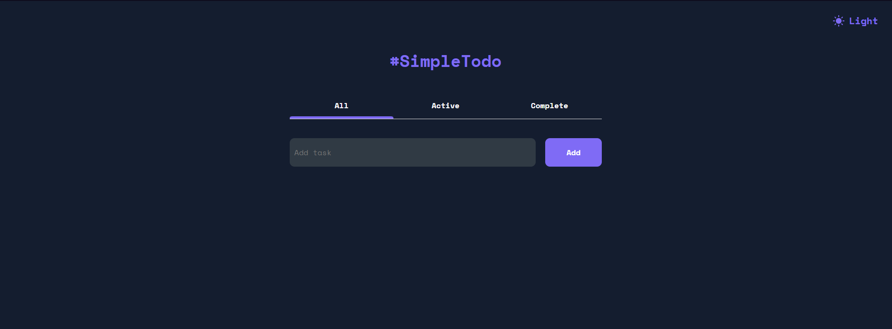
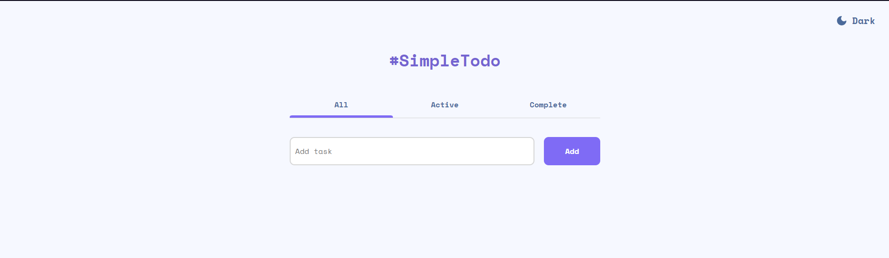
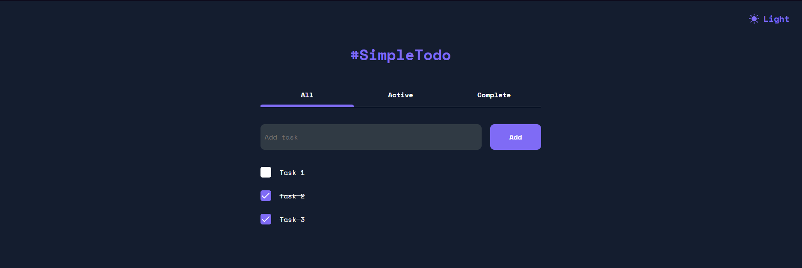
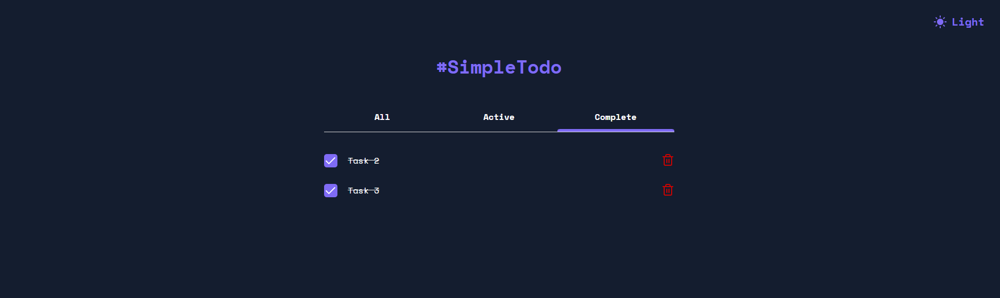

<h1 align="center">SimpleTodo</h1>

<h3 align="center">🚀 <a href="https://devchallenges.io">DevChallenges</a> - Todo app</h3>

  

  

  

<h2 style="margin-top: 30px;"> 
	📷 Screenshots  

  <h2 style="margin-top: 20px;">Dark</h2>

  

  <h2 style="margin-top: 20px;">Light</h2>

  

  <h2 style="margin-top: 20px;">Checking</h2>

  

  <h2 style="margin-top: 20px;">Delete</h2>

  
</h2>

<h2 style="margin-top: 30px;"> 
	📚 Learned concepts
</h2>

- LocalStorage to save tasks and theme
- UUID to create dynamic ids for tasks

<h2 style="margin-top: 30px;"> 
	🔗 Link
</h2>

- <h3 style="margin-top: 20px;"> Demo - <a href="https://simple-todo-robertoguto.vercel.app">SimpleTodo</a></h3>

<h2 style="margin-top: 30px;"> 
	🚀 How to run
</h2>

- Clone the repository
- Install dependencies with <code>yarn</code>
- Start the project with <code>yarn start or ng serve -o</code>
- It can be accessed at <code>localhost:4200</code>

Made with ❤️ by robertoguto
